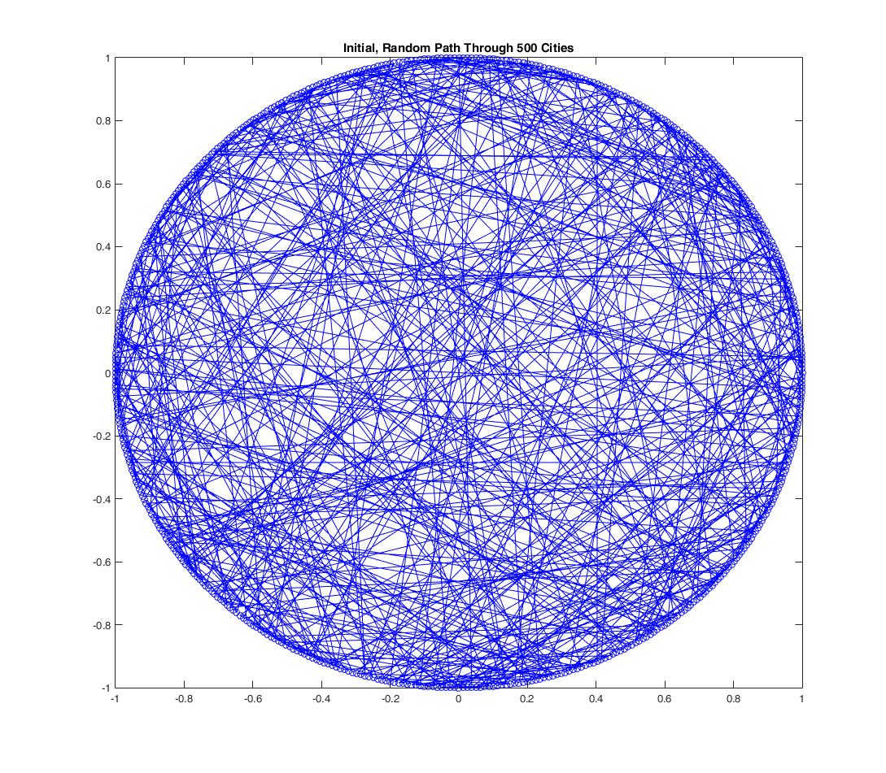
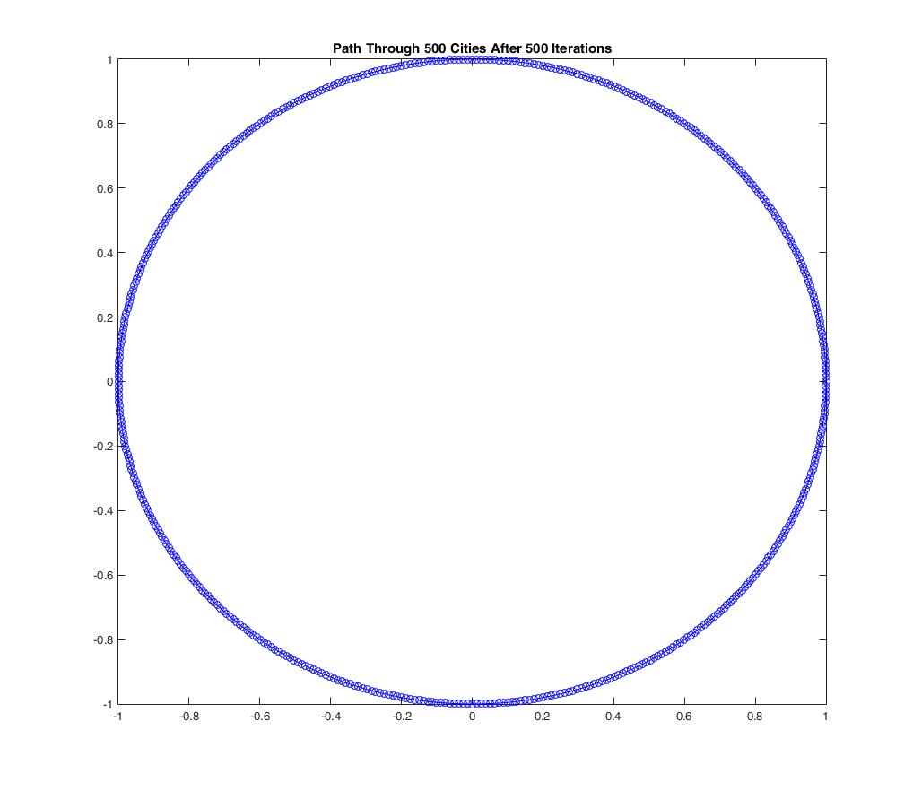
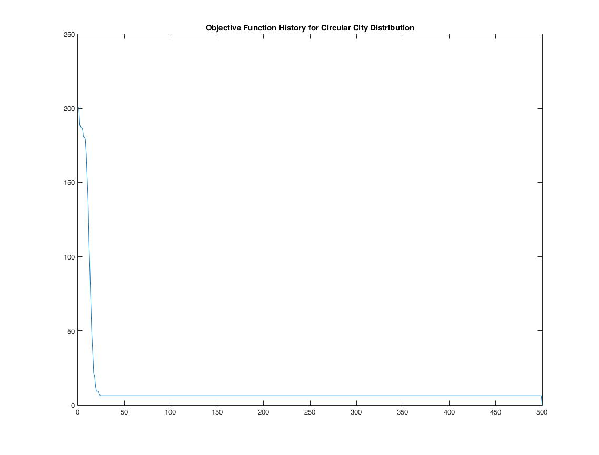
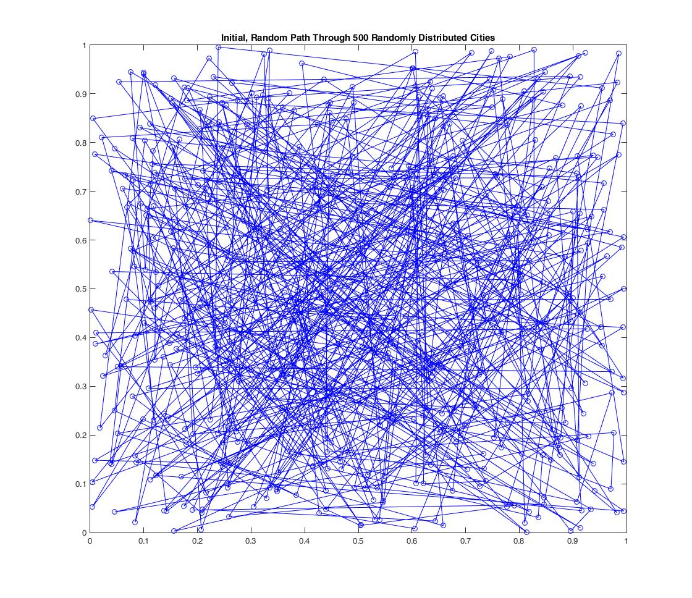
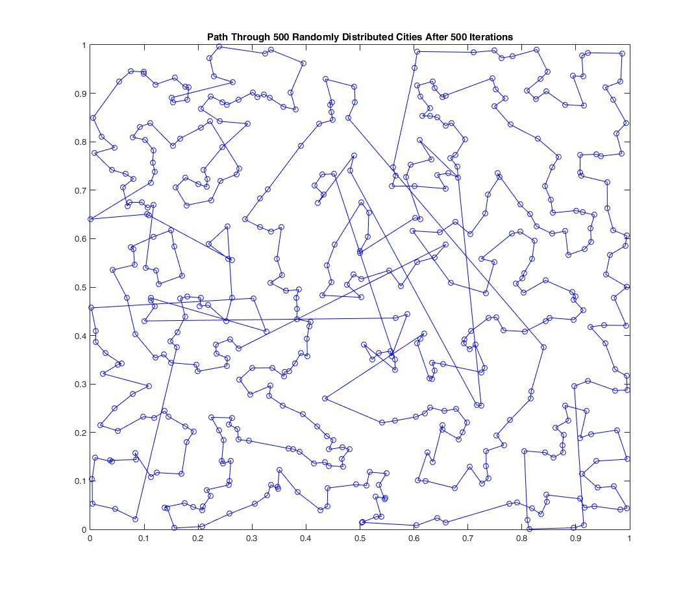
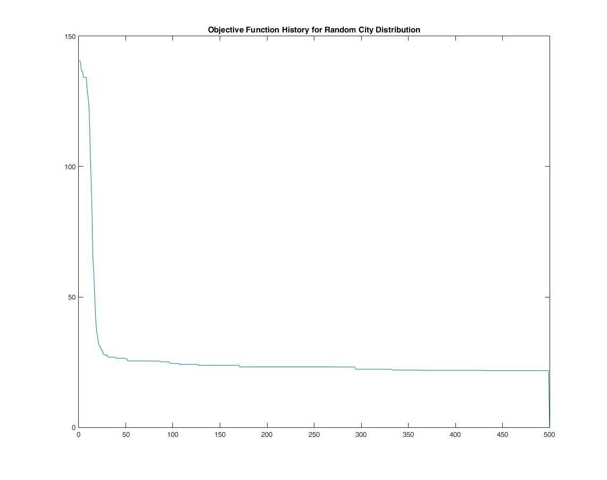

# Ant Colony Optimization For the Travelling Salesman Problem

This repository contains a working Matlab implementation of the Ant Colony Optimization algorithm for the Travelling Salesman Problem. The Matlab scripts generate some number of cities in a cirular or random distribution, and then run some number of iterations to find the best path through those cities.

## Circular City Distribution

Here are some figures showing the algorithm performance for a circular arrangement of cities (this is more of a sanity check, this arrangement should be easy to solve).

## Random City Distribution

Here are some figures showing the algorithm performance for a random city distribution:

